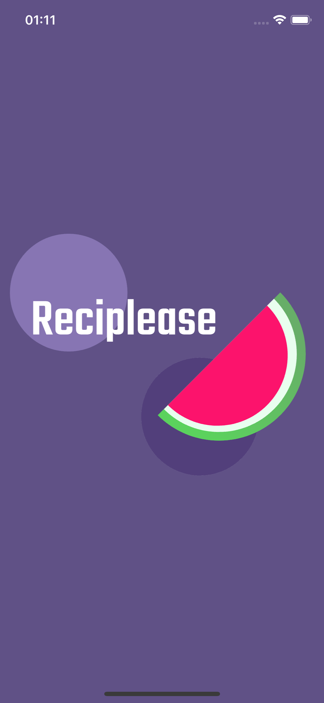
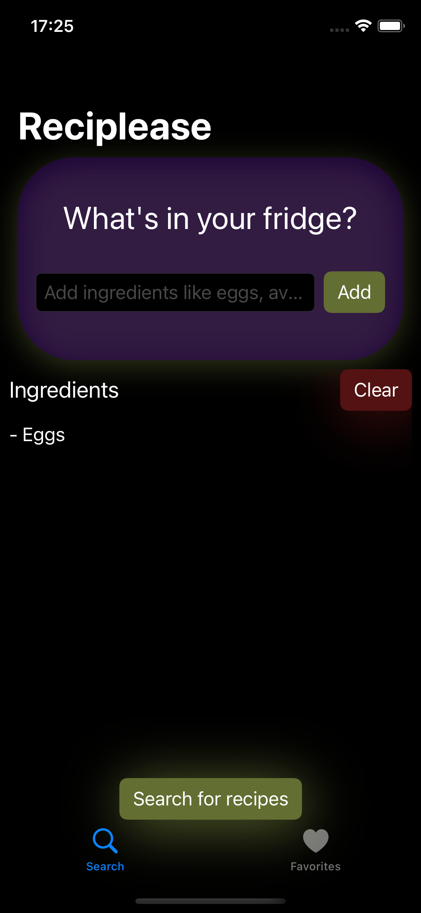
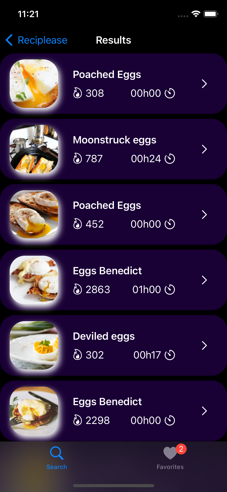
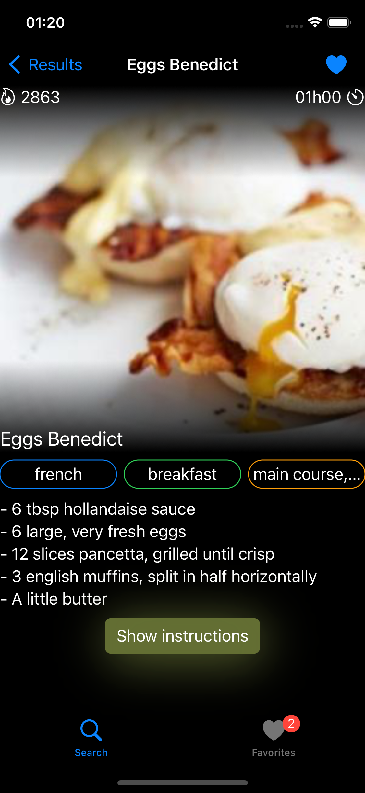
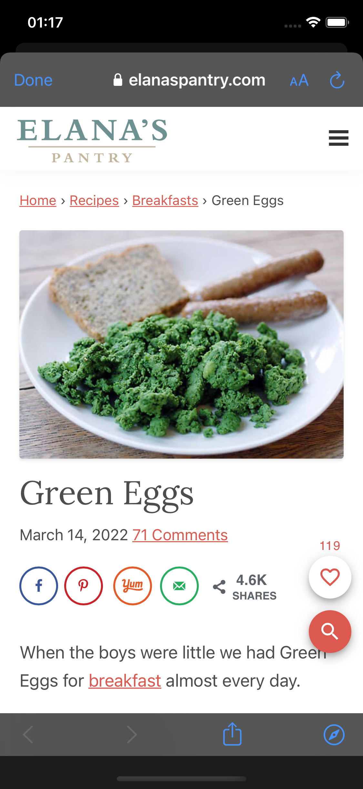
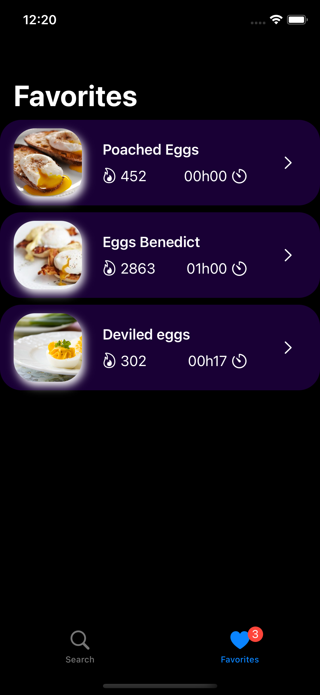

# Le Baluchon - Travel dude

 
 
 
  

## About the application

This application allows a user to ass ingredients in a list and search recipes that can match his ingredients. The user can save recipes to have a short acces to them or to see them offline.

I had to code this application using GreenCode, so I decided to choose dark themed colors, Combine and Concurrency to help me to be more efficient with energy consumption.

Each element of this application are being accessible with VoiceOver.

---
### Features available
- Add ingredient
- Search for recipes
- See the details of a recipe
- Add a recipe in favorite
- See favorite without network

### Previews

#### LaunchScreen

#### Search

#### Result

#### Recipe

#### Safari instructions view

#### Favorites

